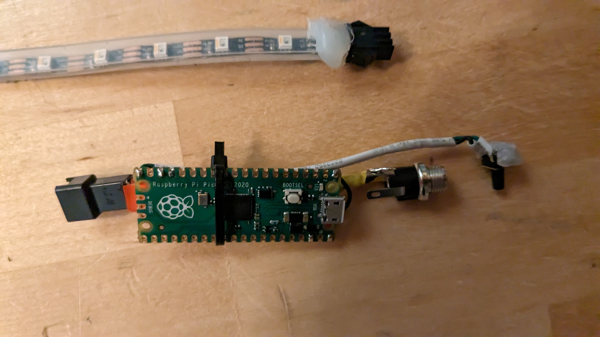
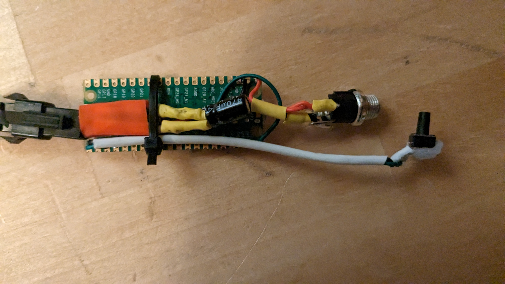
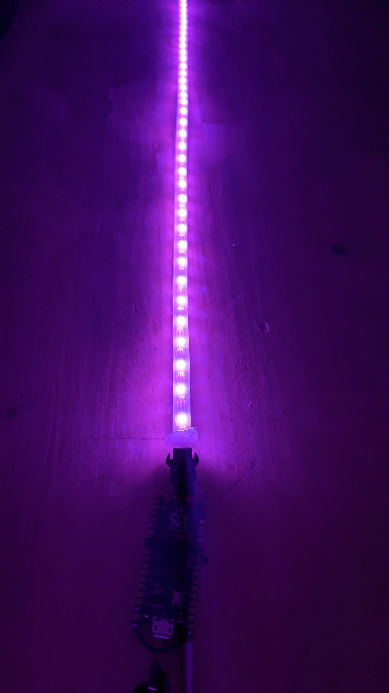
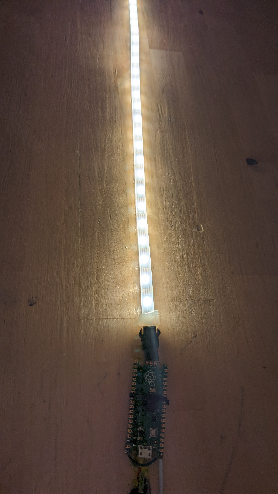

## Finished WRGB lights

This project took me much longer than I anticipated. My idea was simple, just make some lights that can change colors so you have something nice looking, but is also usefull for reading at night, and just chnage the mode with the push of a button, turns out, it wasn't as simple as it sounded :). But for someone who is pretty new with all this electronics and microcontroller stuff I must say I'm pretty satisfied with the result. :)

