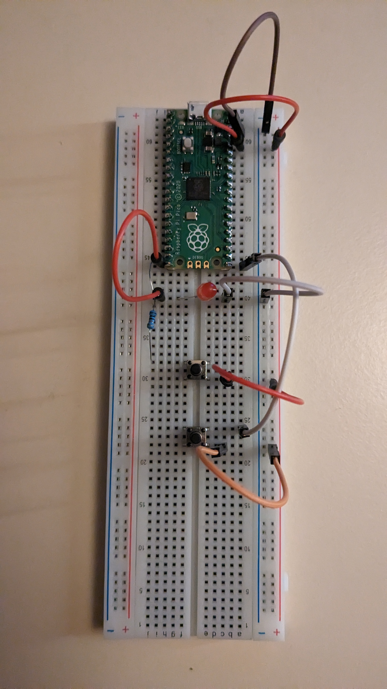
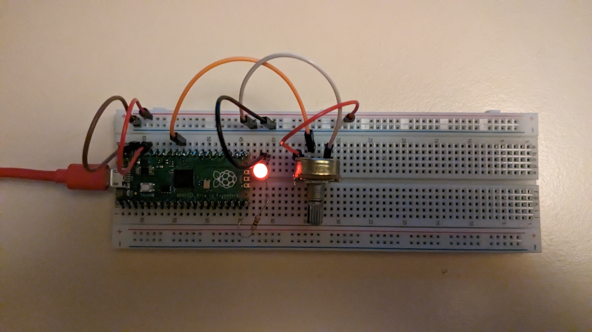

# Here are my projects from the "Get started with Micropython on PiPico" book.

### Trafficlight breadboard setup

### ReactionGame two player time meassuring breadboard setup

### Potentiometer dimming LED breadboard setup

